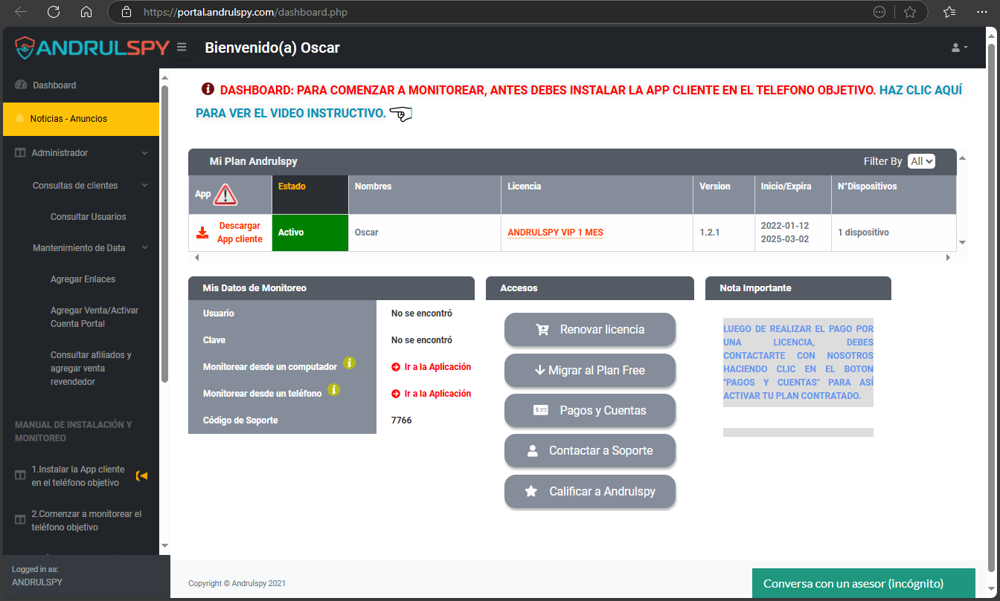

# SoftwareControlParental
Apoyo en el desarrollo de la web andrulspy.com y subdominios, un software de control parental para la supervisión de niños y empleados. 
### Subdominios:
  Web: https://andrulspy.com
	Clientes: https://portal.andrulspy.com
	Afiliados: https://portal.andrulspy.com/loginafi.php
### Realizado con
Lenguaje y tecnologías: PHP, VB, javascript, Bootstrap, css, html, Mysql, Composer, Chekout Mercadopago, Api Paypal y Windows server 2016.

